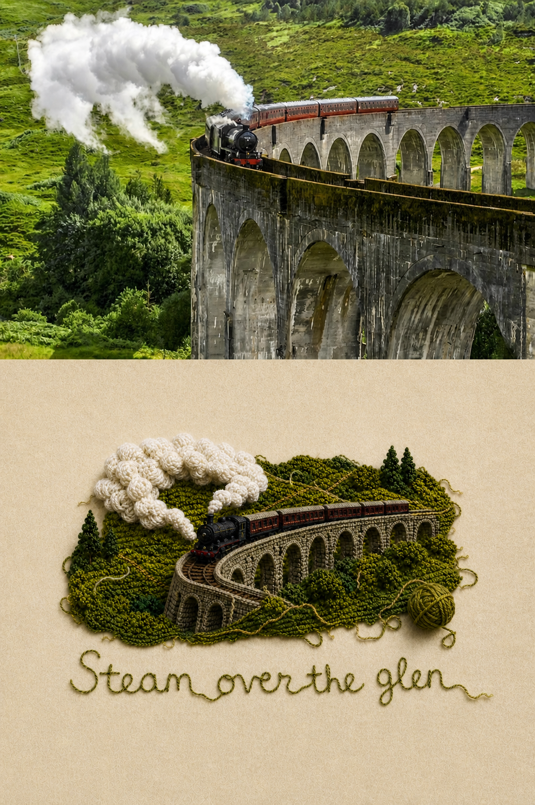
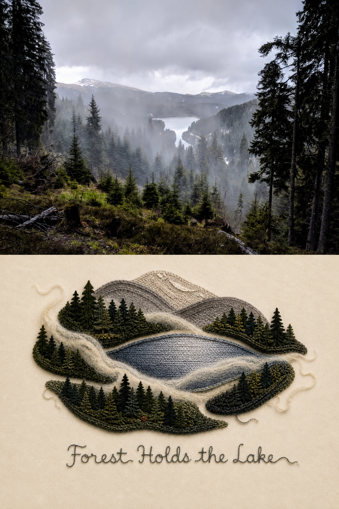

# Photo to Organic Knit

An open-source Codex skill that reimagines a photograph as a concept-driven, handcrafted knitted-wool art poster.

The skill preserves source orientation and a few recognition anchors, then deliberately discards or abstracts secondary detail, invents a new graphic composition, and applies tactile crochet, knit, boucle, felt, loose fibers, irregular textile edges, editorial negative space, and single-strand yarn lettering. It is designed for genuine reinterpretation—not a wool filter over the original photograph.

## Before and after

The skill keeps a few recognizable anchors from each source while rebuilding the hierarchy, shapes, negative space, and visual path as a tactile knitted-wool art poster.

### Steam Over the Glen



### Forest Holds the Lake



## Features

- Matches landscape, portrait, or square source orientation.
- Sorts source elements into retain, transform, and discard groups before generation.
- Builds one visual concept and changes at least three structural qualities of the original composition.
- Uses devices such as negative-space symbols, textile islands, yarn paths, scale contrast, or layered collage when appropriate.
- Keeps the textile vignette compact with generous room for cover or brand layouts.
- Adds restrained handmade imperfections instead of machine-perfect repetition.
- Converts only key photographic elements into tactile knitted forms without copying the example subject or tracing the photo layout.
- Adds a readable 2–4 word thematic title in childlike, single-strand yarn lettering unless text is disabled.

## Install

Copy the `photo-to-organic-knit` folder into your Codex skills directory:

```bash
cp -R photo-to-organic-knit "${CODEX_HOME:-$HOME/.codex}/skills/"
```

Restart or refresh Codex so it can discover the skill.

## Use

Attach a photograph and invoke the skill:

```text
Use $photo-to-organic-knit to turn this photo into an organic knitted-wool illustration.
```

You can also specify exact title text:

```text
Use $photo-to-organic-knit on this image and add the title "Wind Through Pines" in clear single-strand yarn handwriting.
```

By default, a horizontal source produces a horizontal illustration, a vertical source produces a vertical illustration, and a square source remains square.

## Repository structure

```text
photo-to-organic-knit/
├── SKILL.md
├── agents/openai.yaml
├── assets/style-reference.png
└── references/style-spec.md
```

## License

MIT. See [LICENSE](LICENSE).
