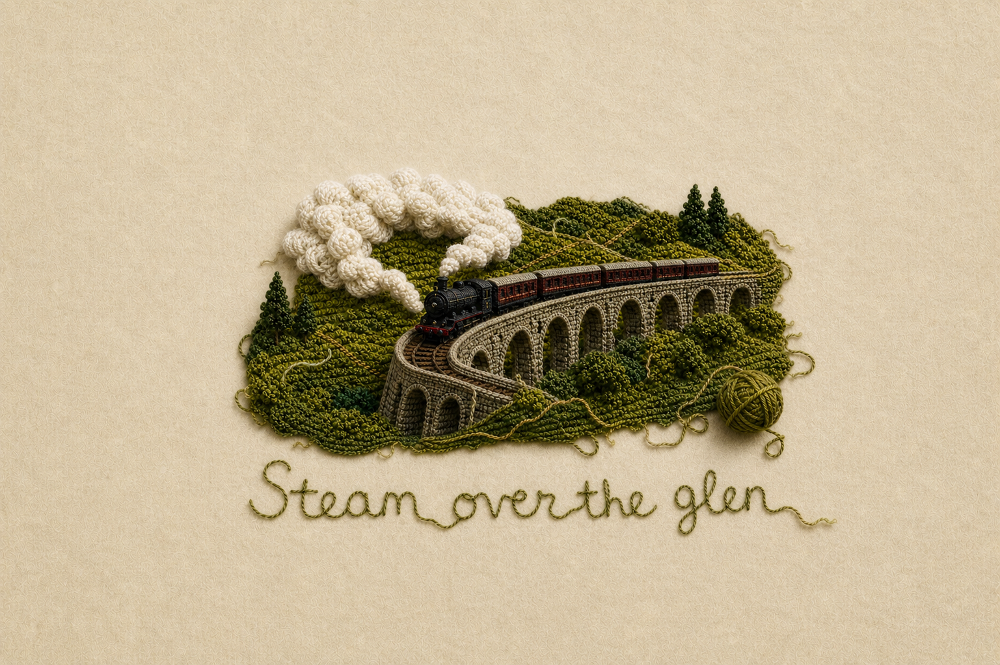

# Photo to Organic Knit

An open-source Codex skill that transforms a photograph into a spacious, handcrafted knitted-wool illustration.

The skill preserves the source image's orientation and recognizable subject while applying tactile crochet, knit, boucle, felt, loose fibers, irregular textile edges, editorial negative space, and optional single-strand yarn lettering.



## Features

- Matches landscape, portrait, or square source orientation.
- Keeps the textile vignette compact with generous room for cover or brand layouts.
- Adds restrained handmade imperfections instead of machine-perfect repetition.
- Converts key photographic elements into tactile knitted forms without copying the example subject.
- Supports optional readable, childlike, single-strand yarn titles.

## Install

Copy the `photo-to-organic-knit` folder into your Codex skills directory:

```bash
cp -R photo-to-organic-knit "${CODEX_HOME:-$HOME/.codex}/skills/"
```

Restart or refresh Codex so it can discover the skill.

## Use

Attach a photograph and invoke the skill:

```text
Use $photo-to-organic-knit to turn this photo into an organic knitted-wool illustration.
```

You can also specify exact title text:

```text
Use $photo-to-organic-knit on this image and add the title "Wind Through Pines" in clear single-strand yarn handwriting.
```

By default, a horizontal source produces a horizontal illustration, a vertical source produces a vertical illustration, and a square source remains square.

## Repository structure

```text
photo-to-organic-knit/
├── SKILL.md
├── agents/openai.yaml
├── assets/style-reference.png
└── references/style-spec.md
```

## License

MIT. See [LICENSE](LICENSE).
